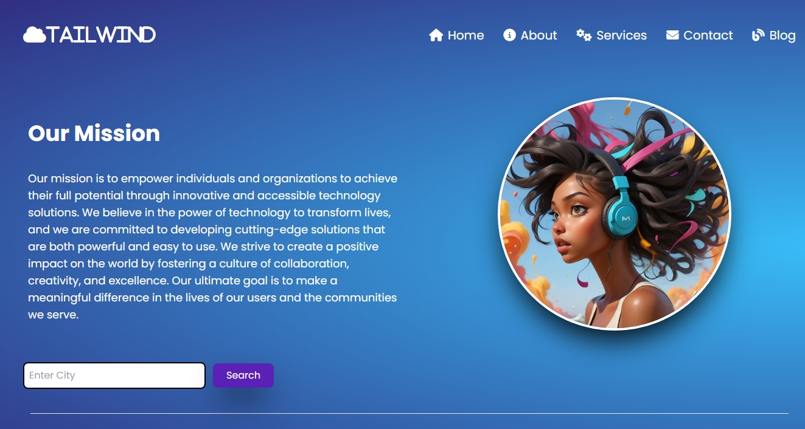

# Tailwind Project

A responsive landing page built with Tailwind CSS and GSAP animations.


## Features

- **Responsive Design**: Mobile-first approach with hamburger menu
- **Smooth Animations**: GSAP-powered entrance animations
- **Modern UI**: Gradient backgrounds and clean typography
- **Interactive Elements**: Hover effects and transitions

## Technologies

- HTML5
- Tailwind CSS (CDN)
- GSAP 3.12.5
- Font Awesome 6.7.2
- Google Fonts (Poppins)

## File Structure

```
├── index.html          # Main HTML file
├── script.js           # JavaScript animations and menu toggle
└── assets/
    └── piclumen-first-01.webp  # Hero image
```

## Setup

1. Clone or download the project
2. Open `index.html` in your browser
3. No build process required - uses CDN links

## Browser Support

Modern browsers with CSS Grid and Flexbox support.

## License

© 2025 TailWind. All rights reserved.
